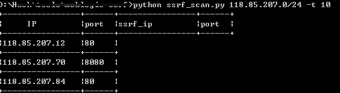

# ssrf_scan
scan ssrf vulnerability of IP segment

Usage：./ssrf_scan IP/CIDR –t threads

Example:./ssrf_scan.py 10.20.30.0/24 –t 10

一个python爬虫工具多线程扫描ip段Weblogic-ssrf漏洞，例子中的ip是我之前挖掘出的一个电信网站的漏洞，现已被修复

